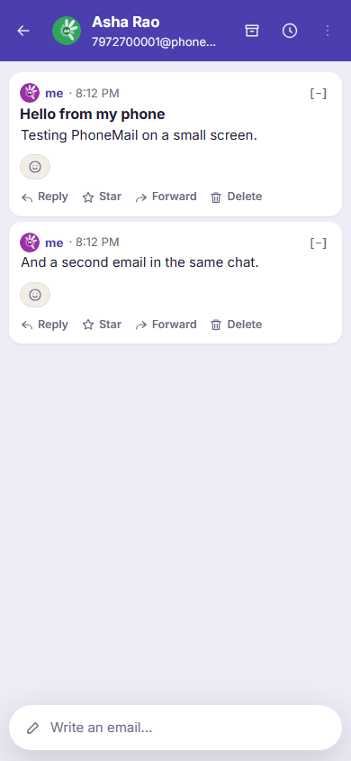
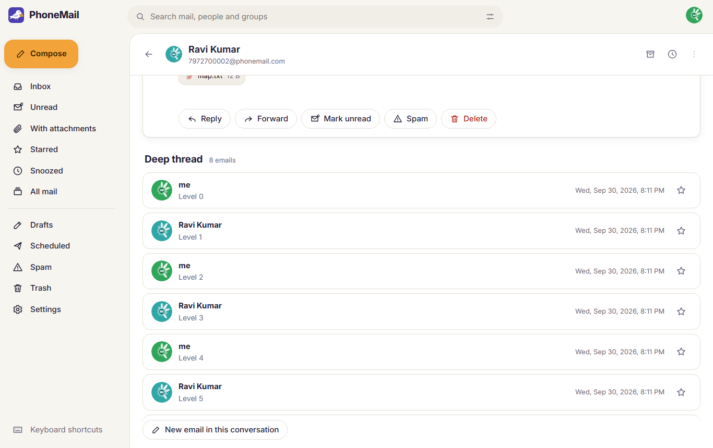
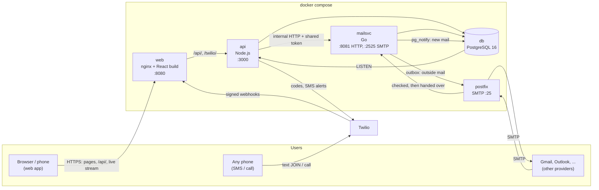
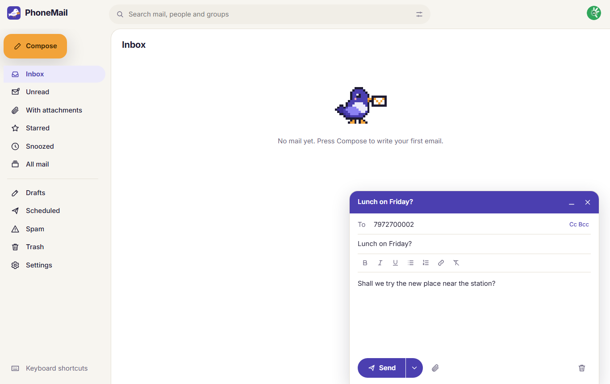
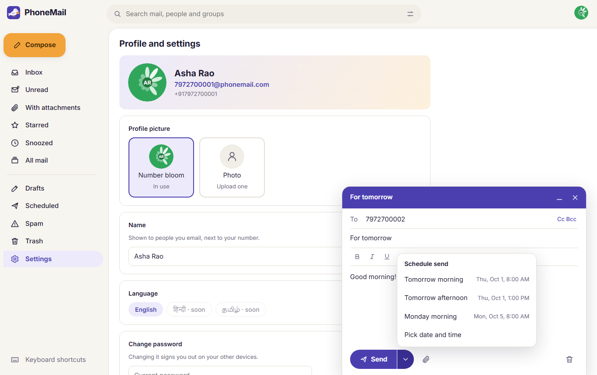

<p align="center"></p>

# PhoneMail

**Email where your phone number is your address.** Sign up with your mobile number and you have
`9876543210@phonemail.com`: no username to invent, nothing to remember. You can sign up on the
web, by texting `JOIN`, or by calling a number and pressing 1. Mail arrives as chats, like
WhatsApp on your phone and like Gmail on a big screen, and it works with every other email provider.

The AlphaStack 7-day Buildathon submission of **Team Node Nexus**. Live at **https://mail.phonemail.net**.

<p align="center">
  
  &nbsp;
  
</p>

- [Set it up and run it](#set-it-up-and-run-it) (start here)
- [Tech stack](#tech-stack)
- [Architecture](#architecture)
- [Approach and design decisions](#approach-and-design-decisions)
- [Features](#features)
- [Tests](#tests)
- [Documentation](#documentation)

---

## Set it up and run it

Everything runs in Docker, so the only thing to install is **Docker** (Docker Desktop on Windows
and macOS; Docker Engine with the Compose plugin on Linux). Nothing else: no Node, Go or
PostgreSQL on the machine itself. It works on Windows, macOS and Linux, on Intel/AMD and ARM
(it runs in production on a small ARM home server).

### 1. Get the code

```bash
git clone <this repository's URL> phonemail
cd phonemail
```

### 2. Settings: the `.env` file

All settings live in one file, `.env`, in the top folder. The repository has an **empty** `.env`
as a placeholder.

- **If you were given a `.env` file** (for example, with the submission): put it in the top folder in
  place of the empty one. That's all.
- **Otherwise**, make one from the example and fill in the two required secrets:

  ```bash
  cp .env.example .env            # Windows PowerShell: copy .env.example .env
  ```

  Then open `.env` and set `INTERNAL_TOKEN` and `POSTGRES_PASSWORD` to two different long random
  values. On macOS or Linux, `openssl rand -hex 32` makes one. On Windows PowerShell, use
  `-join ((1..32) | % { '{0:x2}' -f (Get-Random -Max 256) })`.
  PhoneMail refuses to start with an empty or short secret, on purpose.

The other settings all have working defaults (see comments in `.env.example`). Without Twilio keys,
sign-in is **phone number + password**, the brief's own fallback, so no outside accounts are needed.

### 3. Start it

```bash
docker compose up -d --build
```

The first build takes a few minutes (it compiles the Go mail service and the React app). When
`docker compose ps` shows every service as `healthy`, it's ready:

| Open | What it is |
|---|---|
| http://localhost:8080 | The web app (use a phone-sized window to see the phone layout) |
| http://localhost:8080/register/ | The sign-up portal: phone number and code, clears itself after each account |
| http://localhost:8080/api/health | Health check: `{"ok":true,...}` |

All ports are bound to this computer only (`127.0.0.1`).

### 4. Try it

1. Open http://localhost:8080, choose English, type any 10-digit number (e.g. `9876500001`) and a
   password of 8+ characters, then press **Next**. A new number signs up; a known one signs in.
2. In a second browser (or a private window), sign up a second number, e.g. `9876500002`.
3. From the first, **Compose** an email to `9876500002` and send it. It appears for the second person
   at once (no reload), with an unread badge.
4. Reply, and try replying to the same email twice: *"You've already replied to this email."*
   (each email can be answered once per person, as the brief asks).
5. Put two numbers in **To**: PhoneMail asks for a group name and starts a group chat.

**Mail from outside ("SMTP local").** The `postfix` container is a real SMTP server on port 25.
Mail sent to it for a PhoneMail number is checked, delivered and shown live:

```bash
# any SMTP client works; with swaks (https://jetmore.org/john/code/swaks/):
swaks --server 127.0.0.1:25 --from friend@example.com --to 9876500001@phonemail.com \
      --header "Subject: Hello from outside" --body "It works!"
```

Mail from PhoneMail to outside addresses goes out through the same Postfix. Home internet
connections usually block outgoing port 25; set `POSTFIX_RELAYHOST` (and its login) in `.env` to
send through any mail provider instead.

**Sign-up by SMS and phone call** need a Twilio number: put `TWILIO_ACCOUNT_SID`,
`TWILIO_AUTH_TOKEN`, `TWILIO_VERIFY_SID` and `TWILIO_FROM_NUMBER` in `.env` and `PUBLIC_BASE_URL` to
the public https address Twilio can reach. Sign-in then uses one-time SMS codes; texting `JOIN` or
calling and pressing 1 creates an account.

### Stop, reset, troubleshoot

```bash
docker compose down        # stop (keeps all data)
docker compose down -v     # stop and delete all data
docker compose logs -f api mailsvc postfix   # watch what's happening
```

- **"Set INTERNAL_TOKEN in .env"** or **"POSTGRES_PASSWORD"**: step 2 isn't done yet.
- **A port is already in use** (e.g. something else on port 25 or 8080): change `POSTFIX_PORT`,
  `WEB_PORT`, `API_PORT`, `DB_PORT`, `MAILSVC_PORT` or `SMTP_PORT` in `.env` and start again.
- **Running without the Postfix container** (a server with its own mail server): remove
  `COMPOSE_PROFILES=postfix` and `SMTP_RELAY` from `.env`.

---

## Tech stack

| Part | Technology | Why |
|---|---|---|
| Mail service | **Go 1.22**, `pgx` (PostgreSQL), `bluemonday` (HTML cleaning) | Fast, small, built for network servers; one static binary |
| API | **Node.js 22** (no framework), `postgres.js` | Twilio, web push and live streams have first-class Node support |
| Web app | **React 19 + TypeScript**, built with **Vite**, served by **nginx** | App-like pages; installable on phones (web app manifest) |
| Database | **PostgreSQL 16** with `ltree` and full-text search | One database for users, chats, threads, rules and search |
| Email transport | **Postfix** (Docker, Alpine) | The standard SMTP server: mail in from and out to the internet |
| SMS and calls | **Twilio** Verify, Messaging and Voice | One-time codes, JOIN texts, call-in sign-up, SMS alerts |
| Live updates | Server-Sent Events + PostgreSQL `LISTEN/NOTIFY` | New mail appears without reloading |
| Everything | **Docker Compose** | `docker compose up -d` starts it all on any machine |
| Tests | Go tests, Node's test runner, PowerShell smoke test, **Playwright** | Every layer, including real browsers |

## Architecture



- **web**: nginx serves the React app and passes `/api/` and `/twilio/` to the api. Browsers only
  ever talk to it.
- **api**: sign-in (one-time codes, passwords, sessions), accounts, profile pictures, aliases,
  Twilio webhooks (JOIN texts, call-in), live updates and alerts (web push, or the brief's SMS).
  It forwards every mail request to the mail service with the signed-in person's id.
- **mailsvc**: everything about mail: sending, replies, chats, groups, threads, drafts, folders,
  search, attachments, scheduled sends, and the SMTP side (receiving on 2525, the outbox worker
  that sends through Postfix). Never reachable from outside.
- **db**: one PostgreSQL database. Each email is stored **once**; each person gets a small
  *pointer* row with their own read, star and folder flags. Chats are rows in `conversations`;
  threads are `ltree` paths, so a whole thread is one query.
- **postfix**: the border with the rest of the email world. It checks every incoming address with
  the mail service first (unknown numbers are refused before any data is accepted).

More detail, including the data model and how a message travels: [docs/ARCHITECTURE.md](docs/ARCHITECTURE.md).

## Approach and design decisions

- **Rules live on the server.** Everything the brief asks for is enforced by the mail service and
  the database, not just the screens: *reply once* is a unique database rule on (email, sender);
  recipients inside a chat are locked by the server. Any client, including a future mobile app,
  behaves the same.
- **Built in slices, each tested before the next:** data model and mail rules first, then sign-in,
  then the web app, then phone sign-up and alerts, then mail from other providers, then the
  Gmail-style extras.
- **Two services, as in the team's spec:** the Node api owns people, the Go service owns mail.
  They share one database and talk over internal HTTP with a shared secret.
- **Chats, not folders:** there's no Inbox/Sent split. Mail with each person or group is one chat,
  shown WhatsApp-style on phones and Gmail-style on computers (a thread's emails stacked, or
  Reddit-style nested replies on phones).
- **Groups:** two or more people in To start a group, which must be named; later mail to one of
  them stays in the one-to-one chat. An existing group is addressed by its name.
- **People outside PhoneMail** get ordinary email; to PhoneMail users they're a normal chat, and
  their answers join the right thread.
- **Secure by default:** sessions in HttpOnly cookies, CSRF protection, rate limits, cleaned HTML,
  signed Twilio webhooks, secrets only in `.env`, every port on 127.0.0.1, per-person storage limits.
- **Self-hosted:** it runs on a small home server behind nginx and Let's Encrypt; no third-party
  hosting or trackers.

## Features

What the brief asked for, and where each is done: [docs/REQUIREMENTS.md](docs/REQUIREMENTS.md).

- **Sign-up:** web (phone + SMS code, or password), a two-field sign-up portal, a text (`JOIN`),
  or a phone call (press 1). PhoneMail never calls anyone.
- **Mail as chats:** Home is a chat list with search and filters (All, Unread, Attachments,
  Favourites, Snoozed, All mail); subjects only on new emails; reply once per email; long emails
  open to full view; swipe right to reply on phones.
- **Groups** with admins, activity lines ("Asha added Ravi") and member search.
- **Gmail-style extras:** formatting and signatures, forward, undo send, schedule send, snooze,
  archive, mark unread, bulk actions, search operators (`from:`, `has:attachment`, `before:`...),
  mute, block, emoji reactions, keyboard shortcuts, picture/PDF viewer, drafts that wait in their chat.
- **Alerts:** live updates in open tabs; web push; the brief's SMS for people without the app.
- **Other providers:** send to and receive from Gmail and others through Postfix.
- **Account:** aliases (`asha.rao@phonemail.com`), profile pictures (a "number bloom" drawn from
  your number, or a photo with private on-device styles), download your data, delete your account.
- **Pip**, a pixel-art carrier pigeon mascot.

<p align="center">
  
  
</p>

## Tests

| Suite | How to run | What it covers |
|---|---|---|
| Mail service (Go) | `cd mailsvc && go test -p 1 ./...` with `TEST_DATABASE_URL` set | Mail rules, groups, threads, drafts, search, outside mail, SMTP |
| API (Node) | `cd api && npm test` with `TEST_DATABASE_URL` set | Sign-in, sessions, Twilio webhooks, alerts, security |
| Whole system | `powershell -File scripts/smoke-test.ps1` (needs `AUTH_MODE=console`) | 90 checks through the running containers, including Postfix |
| Browsers | `cd web/e2e && npm install && npx playwright install chromium && npm test` | 24 tests: three people using every screen on desktop and phone sizes |

The test suites **wipe** the database they're given, so point them at a separate one (see
[docs/OPERATIONS.md](docs/OPERATIONS.md)).

## Documentation

| Document | What's in it |
|---|---|
| [docs/ARCHITECTURE.md](docs/ARCHITECTURE.md) | Services, data model, how a message travels, security |
| [docs/REQUIREMENTS.md](docs/REQUIREMENTS.md) | Each requirement of the brief and where it's done |
| [docs/OPERATIONS.md](docs/OPERATIONS.md) | Running tests, backups and restore, production behind https |
| [mailsvc/README.md](mailsvc/README.md) | The mail service: every endpoint, settings, design notes |
| [api/README.md](api/README.md) | The API: endpoints, Twilio setup, security |
| [web/README.md](web/README.md) | The web app: screens, development, browser tests |
