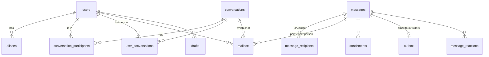

# PhoneMail architecture

## The pieces

| Container | Written in | Reachable from | Job |
|---|---|---|---|
| `web` | nginx + React 19 / TypeScript (Vite build) | the browser (port 8080; in production behind https) | Serves the app; passes `/api/` and `/twilio/` to `api`; security headers and a strict Content-Security-Policy |
| `api` | Node.js 22, no framework, `postgres.js` | `web` only | People: sign-in, sessions, profile, pictures, aliases, push subscriptions, Twilio webhooks, live updates, alerts. Forwards mail requests to `mailsvc` |
| `mailsvc` | Go 1.22, `pgx`, `bluemonday` | `api` (HTTP) and `postfix` (SMTP) | Mail: every rule of the brief, chats, groups, threads, drafts, search, attachments, scheduling, outside mail |
| `db` | PostgreSQL 16 (Alpine, ICU) | `api`, `mailsvc` | All data, one database |
| `postfix` | Postfix on Alpine | the internet (port 25) and `mailsvc` | SMTP border with other providers |

`api` and `mailsvc` talk over internal HTTP. Every request carries a shared secret
(`X-Internal-Token`, 32+ random characters) and the signed-in person's id (`X-User-ID`); the mail
service trusts nothing else. The mail service tells the api about new mail through PostgreSQL
(`pg_notify('mail_events')` inside the delivering transaction, `LISTEN` in the api), so an event
exists exactly when the mail does.

## Data model

- **`messages`**: every email stored **once**, however many people receive it. `parent_id`,
  `root_id` and an `ltree` `path` place it in its thread (`12.15.19`), so a whole thread comes back
  in order with one query. A unique rule on `(parent_id, sender_id)` is **reply once**.
- **`mailbox`**: one small pointer per person per email, with that person's own read, star and
  folder (inbox, spam, trash) marks. Deleting an email for yourself touches only your pointer.
- **`conversations`**: a chat. Direct chats are unique per pair of people; groups are unique per
  (members, name). **`user_conversations`** is each person's Home screen row, kept current on every
  delivery (last email, unread count, archived, snoozed, muted).
- **`users`**: PhoneMail people (a phone number, `addr_key` = its last 10 digits) and people outside
  PhoneMail (an email address, no sign-in).
- **`drafts`**, **`attachments`** (files on disk, named by their SHA-256 so identical files are
  stored once), **`outbox`** (email waiting for Postfix), **`alert_queue`** (push/SMS alerts
  written in the delivering transaction, so none is lost), **`conversation_events`** (group
  activity lines), **`message_reactions`**, **`blocks`**.

Migrations live in `mailsvc/internal/db/migrations` and are applied automatically when the mail
service starts.

## How a message travels

**Between two PhoneMail people** (never leaves the database):

1. The browser sends `POST /api/mail/drafts/{id}/send` (with the Undo delay) to `web`, which passes
   it to `api`.
2. `api` checks the session and forwards it to `mailsvc` with the person's id.
3. `mailsvc` checks everything (recipients, groups, reply once, sizes), then, when the Undo window
   is over, in **one transaction**: stores the message, gives each recipient a pointer in the
   right chat, updates their Home rows, queues their alerts and publishes `mail_events`.
4. `api` hears the event and streams it to the recipient's open tabs (Server-Sent Events), and sends
   a web push, or the brief's SMS "You have received an email from <Sender>. Subject: <Subject>."
   to people without the app.

**From Gmail to a PhoneMail number:** Gmail connects to Postfix on port 25. Postfix asks the mail
service whether the address exists (SMTP `RCPT` on port 2525); unknown numbers are refused before
any data. The email is handed over, its MIME parts are read (text, HTML cleaned of scripts,
attachments), and it is delivered into the recipient's chat with that sender. An answer to a
PhoneMail email joins its thread (`In-Reply-To` / `References`).

**From PhoneMail to Gmail:** the message goes into the `outbox` in the same transaction. A worker
builds a standard email (text + HTML, attachments, threading headers) and hands it to Postfix,
retrying after 1, 2, 4... minutes if Postfix or the other side is busy.

## Sign-in and sign-up

| Way | What happens |
|---|---|
| Phone + SMS code | `api` asks Twilio Verify to text a code, then checks it |
| Phone + password | Without an SMS provider (the brief's fallback); passwords stored as scrypt hashes |
| Sign-up portal `/register/` | Phone + code; creates the account without signing the browser in, then clears |
| Text `JOIN` to the Twilio number | Twilio calls `/twilio/sms` (signature checked); the account is created for the sending number |
| Call the Twilio number, press 1 | Twilio calls `/twilio/voice`; pressing 1 creates the account and texts the address. PhoneMail never places calls |

Sessions are HttpOnly, SameSite cookies (apps may use a Bearer token); every state-changing request
needs an `X-Requested-With` header (CSRF protection).

## Security, briefly

- Every port on `127.0.0.1`; the mail service and database are never exposed.
- Secrets only in `.env`; the services refuse short or default secrets.
- Rate limits on sign-in, codes, sending and search; SMS only to allowed country codes, and never to
  reserved test numbers.
- HTML in emails is cleaned when stored; the web app runs under a strict Content-Security-Policy.
- Attachments download only for their sender and recipients; per-person storage limits.
- Twilio webhooks must carry a valid signature; forged ones get 403.
- Profile photos lose their GPS position and camera details on upload.
- People can download all their data or delete their account (others keep mail they received,
  from "Deleted account").
